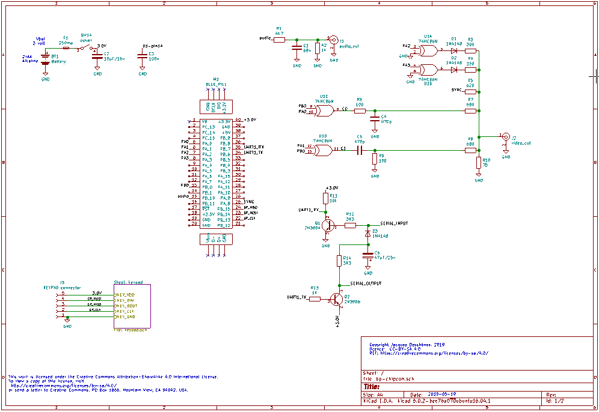

[français](readme.md)

BP-CHIPCON
=
This is a game console made from a blue pill card. This console use an augmented version of SCHIP virtual machine. The caracteristics are the following:

1. Composite NTSC output.
1. 180x112 pixels at 16 colors.
1. Support original SCHIP binaries.
1. BPCHIP virtual machine is an augmented version to support colors and higher resolution. Many operatings codes are added. See **bpcasm.c** file for information about added codes.
1. Tools to support development of games. **bpcasm** is BPCHIP assembler. **cvt-chip** convert SCHIP/BPCHIP binaries in **C** language files for embedding with console firwmare.
1. This is a **GPL v3** licenced project.
1. Hardware is **CC-SA-BY** creative common licence.

Hardware
-
First the blue pill card must be hacked to replace the 8 Mhz crystal by a 14.318 Mhz one. This is a multiple of NTSC chroma frequency required to generate colors.

The blue pill card is cheaply available on eBay or the likes. Also available cheaply is STLINK v2 clones. The only others ICs used are a 74HC84 quad XOR gate and 74HC164 shift register for the gamepad. 2 additionnals transistors are needed for serial port interface. This one is only used in game debugging support. All others components are passive.

This is the schematic. For a more detailed view there is a pdf and the KiCAD project included in this git.

This is the prototype assembly on a DFRobot card.

 
This is the gamepad build around a 74HC164 shift register.
This is similar in working to NES gamepad.

Video modes screen captures
-

 
This is the enhanced BP-CHIPCON mode.

 
This is the super chip mode but with color mapping 
specific to BP-CHIPCON. 

building the project
-

I work on unbutu 18.04 with the arm-none-eabi toolchain installed. There is plenty of information on Internet about installing toolchain on linux for blue pill and other ARM µC, I won't repeat it here.

In the project directory there is a *makefile* That contain the following targets.

1. *build*, the default target that compile with **-O0** optimization. (NOTE: VM crash when compiled with -O0 not debugged yet.)
1. *build_O1*, compile with **-O1** optimization (VM work fine with this optimization).
1. *build_debug*, compile with symbols to debug with **gdb**.
1. *flash*, to program the last binary to blue pill.
1. *debug*, to start gdb debugger session.

To compile the project and flash, on the command line type:

&gt; **make build_O1 && make flash**

To debug the firmware using **gdb** open two commands shell.
and go to the project directory. on first commmand shell type

&gt;  **make build_debug && make flash** 

then

&gt; **st-util**

Switch to next command shell and type:

&gt;  **make debug**

Using BP-CHIPCON console.
=

The console can't load game from external device like a SD card. All games are embedded with the firware and are listed in ghe **Games list** menu. I created a command line tool to convert existing SCHIP games binaries to **C** language source file. The tool produce 2 files, a **.c** file and a **.h** file. See below for more detail about it.

At startup the main menu display

1. **Games list**. Selecting this Item display games availables on the console.
1. **Debug support**. This is to select serial port debugging level for game debugging. It is not related to firwmare debugging with **gdb**. This menu contain:
    

    1. **No debug support**, for normal console use.
    1. **Print PC and OPCODE**, print on serial console
    virtual machine *program counter* and the *opcode* at this position at every step of game execution.
    1. **Print all VM state**, print on serial console all Virtual Machine states during game execution.
    1. **Single step**, print on serial console all Virtual Machine states and stop at each VM instruction. The single stepping is through VT100 keyboard. Any key to execute next step.

1. **video test** is to test video modes during firwmare development. Can be removed in distribution version.
1. **sound test** is to test sound during firmware development. Can be removed in distribution version.

Game development
=

I created 3 tools to support BPCHIP games.

1. **bpcasm**. This is a command line tool. The BPCHIP virtual machine assembler. It convert the assembler source file to binary for the Virtual Machine that execute games.
1. **cvt-chip**. This a command line tool. It convert SCHIP or BPCHIP binaries to **C** language sources files to be embedded with console firmware.
1. **bpcdasm**. This a command line tool. This is a SCHIP binary disassembler. It produre an editable text file recompilable by **bpcasm** assembler. This let one to modify an existing SCHIP game to add functionnalities only available in BPCHIP mode.

Embedding SCHIP binary
-

Many SCHIP binaries are available freely on internet. I already embedded 13 of them in the project. Here I detail the procedure to embed such a file in the project.

The first step is to use **cvt-chip** tool to produce the **C** language required files. Exemple to embed **BLINKY**.
From the tools directory:

&gt; **./cvt-chip games/SGAMES/BLINKY**

&gt; **mv blinky.c blinky.h ../games**

The directory **games/SGAMES** contain binaries of SCHIP games dowloaded from the internet. 

key map
-

The COSMAC VIP at origin of CHIP8 and variants had hexadecimal keypad. BP-CHIPCON as 8 keys gamepad .There is no standard key mapping in games. So for each embedded game the correct keymap must be found and the constant values in the **C** file generated by **cvt-chip** must be changed before building the project.

At the beginning of the file are the following 8 constants that correspond to the BP-CHIPCON gamepad. This is the constants that must be ajusted for each game.

For the game to be accessible through the games list another step is required that consist in editing the **games.c** file. Looking at this file it is quite obvious how to add the new game information to it.

BPCHIP games
=
At this time there is no BPCHIP game written yet. BPCHIP virtual machine is an augmented version of SCHIP virtual machine. It is backward compatible with SCHIP binaries. The background color of BP-CHIPCON is dark green not black. So SCHIP games appears as white on dark green instead of white on black background.

The BPCHIP VM not only add support for colors but many others operating codes. You can find information about theses extra operating codes at the beginning of **bpcasm.c** file. 

There is no documentation on the assembler yet except for its BNF description in **bpcasm_bnf.txt** file. But **bpcasm** is derived from [chipcon v2](https://github.com/Picatout/chipcon_v2) assembler which is documented in **html** format.

Debugging games
-
BP-CHIPCON as no PC emulator yet, although I may eventually adpapt the one I created for [chipcon v2](https://github.com/Picatout/chipcon_v2) project which is a C# project.

The only support to debug a game is trhough VT100 virtual console running on the PC and connected to the console via its serial port. There is no flow control and the setting is **115200 8N1**. 

This far from ideal as one has to recompile the console firmware each time a game bug is corrected.

