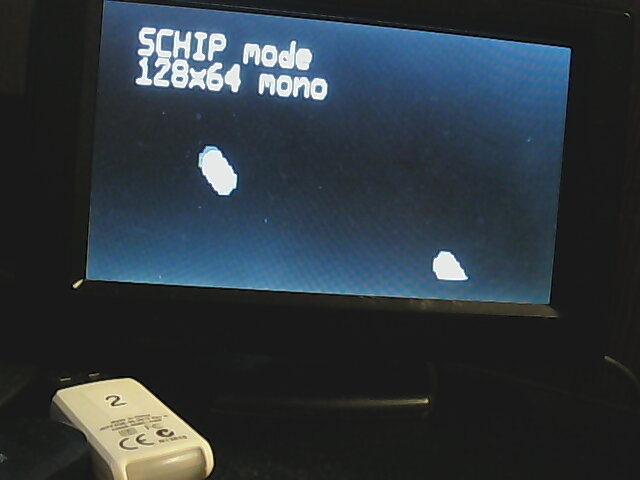

BP-CHIPCON
=

Réalisation d'une console CHIPCON sur une carte blue pill.

* sortie vidéo NTSC
* résolution: 180x112 pixels
* 16 couleurs ou ton de gris.
* 4 palettes de couleurs (incluant les tons de gris).
* version personnelle de CHIPCON
* La machine virtuelle va surporté les modes suivants:
  * CHIP8 64x32 monochrome
  * SCHIP 128x64 monochrome
  * XO-CHIP 128x64  4 couleurs
  * BP-CHIP (version personnelle) 180x112 16 couleurs

NOTES
-

1. Le cristal de 8Mhz sur la carte blue pill doit-être remplacé par un cristal 14.318Mhz. Cette fréquence correspond à 4 fois la fréquence du signal chroma NTSC (3.579545Mhz).
2. XO-CHIP est la machine virtuelle utilisé par [OCTO](https://github.com/JohnEarnest/Octo) de John Earnest.
3. La résolution de 180x112 est un compromis. Le µC stm32f103c8 ne possède que 20480 octets de RAM. Il faut en conserver une partie pour les variables,
le pile et l'espace pour les programme CHIP. avec cette résolution le tampon vidéo accapare 180*112/2=10080 octets. Le tampon vidéo est alloué de manière statique donc on ne sauve pas d'espace RAM en passant aux modes à plus faible résolution. Par contre en renonçant au mode BPCHIP on peut réduite la taille du tampon vidéo à 2048 octets ce qui libèrerait plus de 8000 octets supplémentaires pour les programmes XO-CHIP. Par contre les programmes CHIP8 et SCHIP n'utilise jamais plus de 4096 octets de RAM.

Schématique
-
Ceci est sujet à changement:

carte de montage temporaire:

Photos des différents modes vidéo
-
Mode vidéo CHIP8 original utilisé sur le COSMAC VIP en 1976.
64x32 pixels monochrome.

Mode SUPER CHIP utilisé sur les calculatrices HP-48
128x64 pixels monochrome.

Mode XO-CHIP utilisé dans le projet OCTO de John Earnest
128x64 pixels 4 couleurs.

Mode BP-CHIP  développer pour ce projet.
180x112 pixels 16 couleurs.

notes:
-

1. Les traînées sur les photos sont le résultat d'une animation, 2 balles qui rebondissent sur les rebords de l'écran. 
1. Le floue des caractères est du à la webcam que je n'arrive pas à focusser correctement.
1. Je n'arrive pas non plus à capturer le test barre des couleurs car la webcam sature au blanc, l'ouverture n'étant pas réglable.

