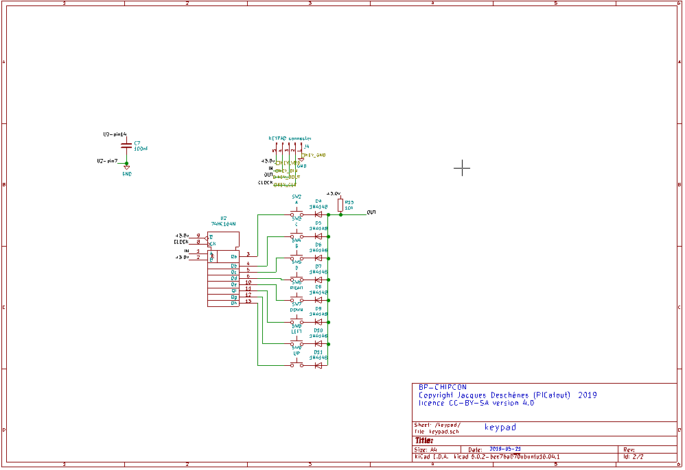
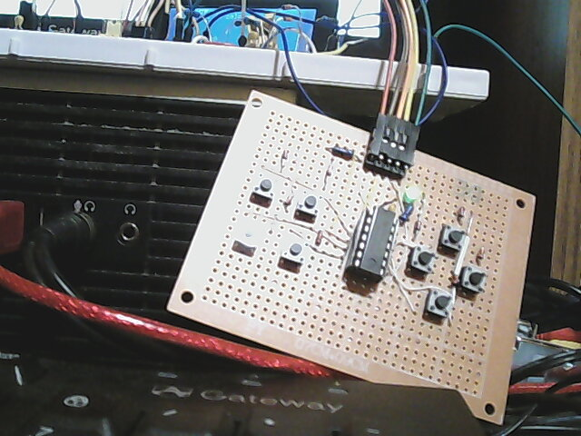
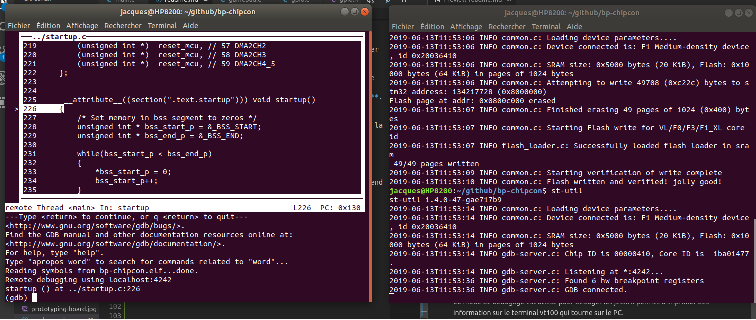
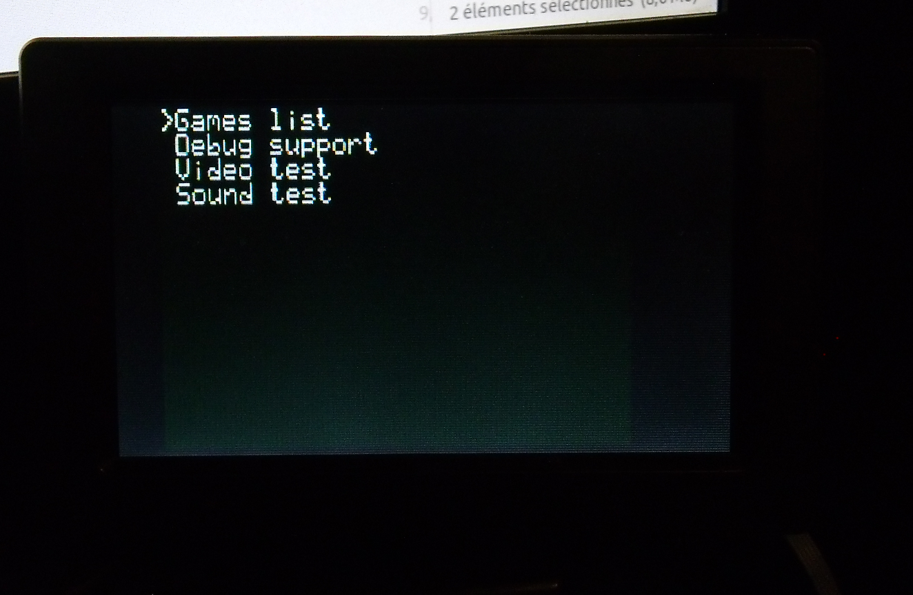

[english](readme(en).md)

BP-CHIPCON
=

Réalisation d'une console SCHIP/BPCHIP sur une carte blue pill. Pour plus d'information sur [CHIP8](http://mattmik.com/files/chip8/mastering/chip8.html) ou [CHIP8+SCHIP](http://devernay.free.fr/hacks/chip8/C8TECH10.HTM).

BPCHIP est une extension personnelle pour ce projet de SCHIP.

* sortie vidéo NTSC
* résolution: 180x112 pixels
* 16 couleurs.
* version personnelle de SCHIP appellée BPCHIP.
* La machine virtuelle surporte les modes suivants:
  * SCHIP 128x64 monochrome.
  * BPCHIP (version personnelle) 180x112 16 couleurs

NOTES
-

1. Le cristal de **8 Mhz** sur la carte **blue-pill** doit-être remplacé par un cristal **14.318 Mhz**. Cette fréquence correspond à 4 fois la fréquence du signal chroma NTSC (3.579545Mhz).
1. La résolution de 180x112 est un compromis. Le µC **stm32f103c8** ne possède que 20480 octets de RAM. Il faut en conserver une partie pour les variables,
le pile et l'espace pour les jeux. avec cette résolution le tampon vidéo accapare 180*112/2=10080 octets. Le tampon vidéo est alloué de manière statique donc on ne sauve pas d'espace RAM en passant au mode **SCHIP** à plus faible résolution. De toute façon SCHIP est limité à 4Ko de mémoire adressable pour les jeux. 
1. 2019-06-12  J'ai abandonné les modes CHIP8 et XO-CHIP. Ne reste que les modes SCHIP et BPCHIP.

Schématique
-
Ceci est sujet à changement:

J'ai fabriqué un *gamepad* avec 8 boutons. Il utilise un registre à décalage 74HC164 pour lire les boutons un peu à la manière des *gamepads* NES et SNES. Et ça fonctionne très bien.

Voici le prototype du gamepad. L'interface matériel comprends 5 fils. Notez qu'ajouter un 6ième fil *select* 
permettrait d'utiliser 2 gamepads en même temps. La modification serait triviale aussi bien au niveau hardware que firmware. Sur la carte **blue-pill** il faudrait utiliser 2 broches supplémentaire pour sélectionner l'un ou l'autre gamepad.

carte de montage temporaire:

 Le montage est fait sur une carte DFrobot. Les pastilles sont sur les 2 faces et sont en forme de croix. De plus il y a 2 rails d'alimentations
sur les bords indentifiés **+** et **-**. C'est une bonne qualité de carte.

Photos des différents modes vidéo
-
Mode SUPER CHIP utilisé sur les calculatrices HP-48
128x64 pixels monochrome. Ici ce n'est pas monochrome car il y a possibilité d'affecter une couleur aux différent sprites avec les nouvelles fonctions de la machine virtuelle **BPCHIP**. Mais les binaires originaux SCHIP apparaissent blanc sur fond vert sombre.

Mode BPCHIP  développé pour ce projet.
180x112 pixels 16 couleurs.

Outils de développement
-

J'ai créé les logiciels suivant pour le développement des jeux. Ces fichiers sont dans le dossier **outils**

1.  **bpcasm**  est l'assembleur de la machine virtuelle **BPChIP**. Il génère un fichier binaire qui doit-être chargé en mémoire RAM du **blue-pill** pour exécution. L'espace maximal pour les jeux **BPCHIP** est de 8Ko mais il est possible d'utiliser les 64Ko de mémoire flash supérieur du stm32f103c8 à l'adresse 0x10000 pour enregistrer des données persistantes.

1. **bpcdasm** permet de désassembler les fichiers binaire **SCHIP** pour modification et réassemblage avec **bpcasm**.

1. **cvt-chip** cette outil convertie les fichiers binaires **SCHIP** ou **BPCHIP** en fichiers **C** pour compilation avec le firmware de la console de jeux. Les fichiers générés par cet utilitaire doivent-être dans le dossier **games**. De plus le fichier **games.c** doit-être modifié pour inclure tout nouveau jeu inclus dans **games**. Ils sont compilés à la suite du firmware dans la mémoire flash dans la section **.user_data** et apparaissent dans le menu **Games list**.

Compiliation
-

Le fichier **makefile**  contient les différentes cibles pour la compilation. il suffit sur la ligne de commande de faire la commande **make nom_cible** pour compiler le projet
les cibles sont les suivantes:

1.  **build_debug**  pour compiler le projet avec le support pour le débogage avec **gdb**.
1. **build**  c'est la cible par défaut permet de compiler sans optimiation i.e. **-O0**. 
1. **build_O1** compile avec l'optimisation **-O1**.
1. **flash**  permet de flasher le microcontroleur sur le **blue-pill** avec le dernier binaire généré. Les fichiers résultant de la compilation sont dans le dossier **build**.
1. **debug** démarre le débogueur **gdb**.

Voici comment je compile et flash le firware à partir de la ligne de commande.

&gt; **make build_O1 && make flash**

S'il n'y a pas d'erreur le binaire se retrouve dans le dossier **build** et la deuxième phase **make flash** prend ce binaire et utilise le programmeur **ST-LINK V2** pour programmer le **stm32f103c8t6** qui est sur la carte **blue-pill**.

Débogage avec gdb
-
Pour déboger le firware avec **gdb** utilisez les commandes suivantes:

&gt; **make build_debug && make flash**

&gt; **st-util**

dans une autre fenêtre console:

&gt; **make debug**

Débogage avec la console sérielle.
-
Ce mode de débogage est utilisé pour déboger les jeux. Il permet d'imprimer des information sur le terminal vt100 qui tourne sur le PC. 

Utilisation de la console
-

Lorsque la console démarre le menu principal suivant apparaît à l'écran.

1. **Games list** affiche et permet de sélectionner un jeu qui a été compilé avec le **firmwware**.

    

2. **Debug support** permet de choisir une des options de débogage de jeu par utilisation du port sériel.

    

    1. **No debug support** pas de support de débogage,pour l'utilisation normale de la console.
    1. **Print PC and OPCODE** imprime sur la console VT100 la valeur du compteur ordinal et le code machine à cette position pour chaque étape d'exécution du programme.
    1. **Print all VM states.** Imprime tous les états de la machine virtuelle à chaque étape d'exécution.
    1. **Single step** imprime tous les états de la machine virtuelle et suspend l'exécution à chaque étape. Il faut enfoncer une touche au clavier de la console VT100 pour avancer pas à pas dans l'exécution du jeu.

1. **Video test**  est utilisé seulement lors du développement de la console pour vérifier le fonctionnement des différents modes vidéo. Cette option peut-être retirée dans la vesion finale.
1. **Sound test**  est utilisé seulement lors du développement de la console pour vérifier le fonctionnement du module sons. Cette option peut-être retirée dans la vesion finale.

NOTES
-

1. **2019-06-13** À ce moment çi j'ai complété le montage d'un prototype de la console et j'ai inclus 13 jeux SCHIP dans le menu jeux. Le premier item **test** n'est qu'un test pour vérifier le bon fonctionnement des fonctions du mode **BPCHIP**. **lem** est un jeu que j'ai importé de mon projet [chipcon v2](https://github.com/picatout/chipcon_v2) mais qui doit-être modifié pour fonctionner correctement dans le monde **BPCHIP**. 

Comment inclure un jeu dans le projet
-
Les jeux ne peuvent pas être chargés dynamiquement à partir d'un périphérique extérieur. Ils doivent-être compilés avec le *firmware* de la console. La procédure est la suivante.

Pour include un jeu SCHIP dont vous avez téléchargé le binaire d'internet la procédure les la suivante. Je vais prendre l'exemple de BLINKY qui est dans **games/SGAMES/BLINKY**. À partir de la ligne de comande:

1. &gt; **cd tools**
1. &gt; **./cvt-chip ../games/SGAMES/BLINKY**
1. &gt; **mv blinky.c blinky.h ../games** 

1. Dans un éditeur de texte modifier les constantes de touches dans le fichier **games/blinky.c** (voir explications plus bas).
1. Dans un éditeur de texte modifiez le fichier **games/games.c** pour include l'information concernant blinky.Pas besoin d'explications, vous comprendrez en regardant le contenu du fichier. 

1. Recontruire et flasher le projet. 
&gt; **cd .. && make build_O1 && make flash** 

[video montrant l'incorporation d'un jeu au projet](https://youtu.be/whA2gxEH0Xo)

key map
-
Les jeux CHIP8 et SCHIP sur HP-48 n'ayant aucun standard quand à utilisation des touches, pour chaque jeu incorporé à la console il faut trouver et configurer les bonnes valeurs de touches dans le fichier **C** généré par **cvt-chip**. Dans notre exemple de BLINKY les valeurs sont les suivantes:

Développement BPCHIP
-
Pour le développement de jeux BPCHIP il suffit de créer un fichier source assembleur **bpcasm**. Une fois compilé en binaire pour **BPCHIP** utilisez la procédure ci-haut pour générer les fichiers d'incorporation au projet.

A ce moment-ci il n'y a pas d'émulateur PC pour BPCHIP donc il n'es pas possible de tester et déboguer sur le PC. Il faut donc faire le débogage en utilisant le menu **Debug support** de la console et un émulateur VT100 sur le PC relié à la console par le port sériel disponible.

Le menu **Debug support** comprend les items suivants:
1. **No debug support** pour l'utilisation normale de la console.
1. **Print PC and OPCODE** à chaque instruction de la machine virtuelle l'adresse du compteur ordinal et le coe opérationnel s'y trouvant est imprimé sur la console VT100.
1. **Print all VM states** imprime tous les états de la machine virtuelle pendant l'exécution du jeu.
1. **Single step** arrête l'exécution à chaque instruction de la machine virtuelle. Imprime tous les états de la machine et attend une touche pour éxécuter la prochaine instrucition. **&lt;CTRL-Q&gt;** sur le clavier du terminal VT100 permet de quitter le pas à pas mais on peut y revenir avec un **&lt;CTRL-C&gt;.**

2019-06-15
-
Ajout d'un vidéo de démonstration sur [youtube](https://youtu.be/HhF0_eT6UJY)

